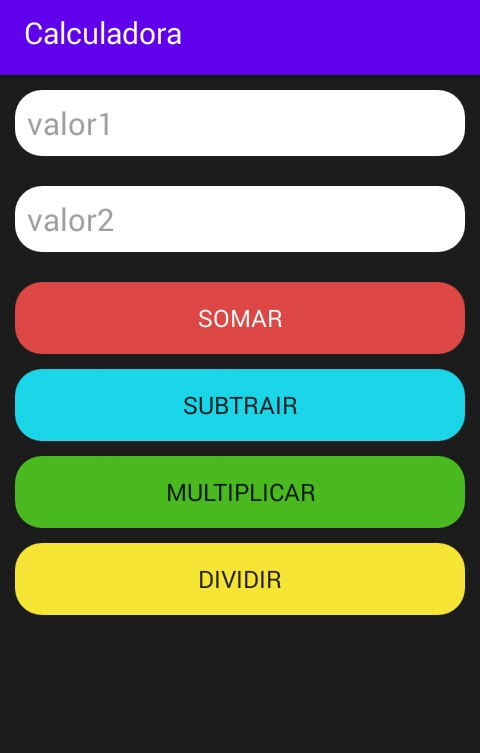

# PyDroid-Project

Crie projetos Android de uma forma rápida sem exigir altos niveis de processamento e memória.


### Testado:
[python 3.6.4](https://www.python.org/downloads/release/python-364/)
``` css
win_x86
win_x64
```
### Tutoriais

- [Configuração do SDK](tutoriais/SDKConfig.md)
- [Criação do Projeto](tutoriais/CriarProjeto.md)
- [Instalação de Dependencies (build.gradle)](tutoriais/Dependencies.md)
- [Instalar App](tutoriais/installApp.md)
- [+Infos](Instalação_do_PyDroid_com_Eclipse_Luna.pdf)

### Edição dos Arquivos

- [Eclipse Luna](https://www.eclipse.org/downloads/packages/release/luna/sr2/eclipse-ide-java-ee-developers) + [plugin ADT](https://dl-ssl.google.com/android/eclipse/)
(RECOMENDADO PARA COMPUTADORES QUE NÃO SUPORTAM ANDROID STUDIO)
- Notepad++
- Sublime Text
- IntelliJ IDEA
- Android Studio

# Calculadora Feita no Eclipse Usando o PyDroid

<br>
<br>
<br>
<br>
<br>

###### ```MUDE O MUNDO```
