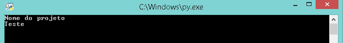
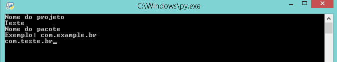
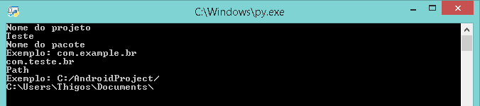

# Criação do Projeto

Para criar o projeto execute o CreateProject.py e siga os exemplos.

1. Escolha um nome para seu projeto:

2. Coloque o nome do pacote (com.nomedopacote.br):

3. Coloque o local que será gerado o projeto:
##### OBS: Coloque uma \ no final do caminho para evitar erros.

4. Espere alguns minutos (Dependendo das configurações do seu computador). O projeto estará pronto quando surgir um sorriso : ), ou quando o terminal fechar.
