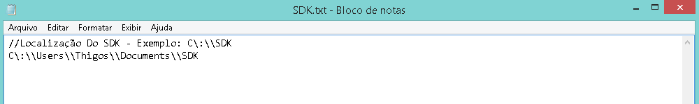

# Configuração do SDK

Para configurar o SDk você precisa colocar o caminho do SDK no arquivo SDK.txt 
Seguindo esse padrão: C\\:\\\path\\\SDK

> 
Imagem de Exemplo

#### OBS:
Não Altere a Primeira Linha.
